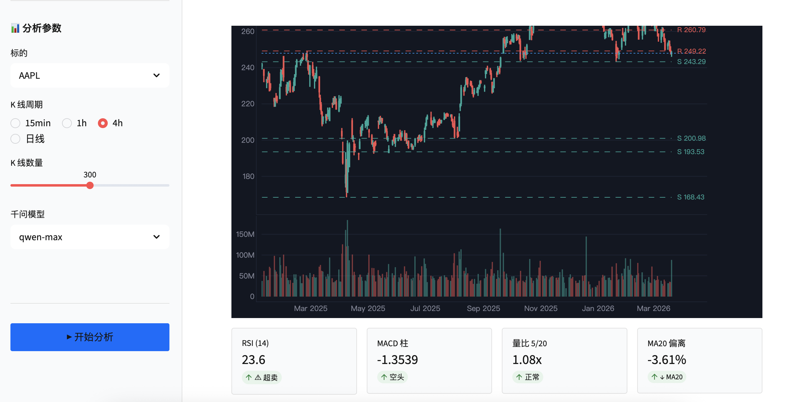
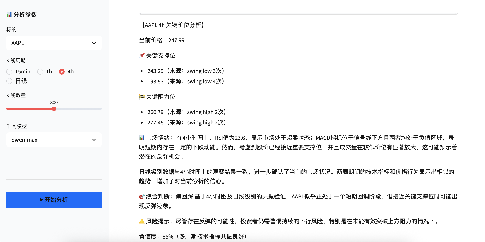

# Quant Levels Agent

基于技术分析 + 千问 LLM 的支撑阻力位智能分析工具，支持加密货币、A 股、美股的多周期分析，并集成钉钉推送。

**Demo：** http://8.149.245.12:8502/

## 界面截图





## 功能特性

- **多资产支持**：加密货币（BTC、ETH、SOL 等）、A 股、美股
- **多数据源**：CCXT（OKX/Gateio/Bybit）、AKShare（A 股）、yfinance（美股）
- **技术分析**：RSI、MACD、均线（20/50/200）、Fibonacci 回撤、成交量聚类、摆动高低点
- **AI 分析**：基于阿里云千问 LLM，支持多轮工具调用的跨周期分析
- **Web 界面**：Streamlit 交互式看板，含 K 线图与支撑阻力位叠加展示
- **钉钉推送**：自动将分析报告推送至钉钉群

## 快速开始

### 环境要求

- Python 3.11+

### 安装依赖

```bash
pip install -r requirements.txt
```

> 阿里云百炼 API Key 申请：https://dashscope.aliyuncs.com

### 运行 Web 界面

```bash
streamlit run app.py
```

访问 http://localhost:8502


**CLI 参数说明：**

| 参数 | 说明 |
|------|------|
| `symbol` | 交易标的，如 BTC、ETH、AAPL、600519 |
| `timeframe` | 时间周期：`15min` / `1h` / `4h` / `日线` |
| `--limit N` | K 线数量，默认 300 |
| `--model` | 千问模型：`qwen-max` / `qwen-plus` / `qwen-turbo`，默认 `qwen-max` |
| `--verbose` | 打印原始技术指标数据 |
| `--dingtalk-webhook` | 钉钉 Webhook URL |
| `--dingtalk-secret` | 钉钉签名密钥 |

## Docker 部署

```bash
# 构建镜像
docker build -t quant-levels-agent .

# 运行容器
docker run -d \
  -p 8502:8502 \
  --name quant-levels-agent \
  quant-levels-agent


访问 http://localhost:8502

## 技术栈

| 组件 | 技术 |
|------|------|
| 后端 | Python 3.11 |
| Web UI | Streamlit |
| LLM | 阿里云千问（OpenAI 兼容 SDK） |
| 数据源 | CCXT / yfinance / AKShare |
| 技术分析 | NumPy / Pandas / SciPy |
| 可视化 | Plotly |
| 部署 | Docker |
| 推送 | 钉钉 Webhook（HMAC-SHA256 签名） |

## 分析流程

1. **数据获取**：根据标的类型路由至对应数据源
2. **技术分析**：计算 RSI、MACD、均线、摆动高低点、Fibonacci 位、成交量分布
3. **位阶聚类**：将价格在 0.5% 容差内归并，统计触及次数
4. **LLM 分析**：多轮工具调用实现跨周期验证，输出专业分析报告
5. **结果输出**：Markdown 报告 + 可选钉钉推送
